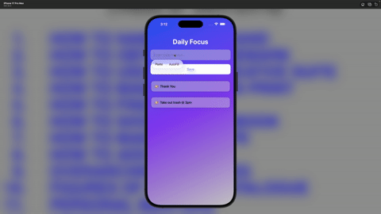

# Daily Focus iOS App

A minimal and modern iOS application designed to help users stay intentional by tracking their daily focus and goals.

## ✨ Features

- User input with TextField
- Persistent data using UserDefaults
- Clean UI built with SwiftUI
- Login screen for structured app flow
- Swipe-to-delete functionality
- Smooth animations for adding/removing tasks
- Custom reusable components (EntryCard)
- Modern gradient UI design

## 🛠 Built With

- SwiftUI
- Xcode
- UserDefaults
- SF Symbols
- Figma (for app icon design)

## 🎥 Demo

## 📱 How It Works

Users can enter a daily focus, save it, and view it in a dynamic list. Entries persist even after closing the app. The interface is designed to be simple, clean, and easy to use.

---

